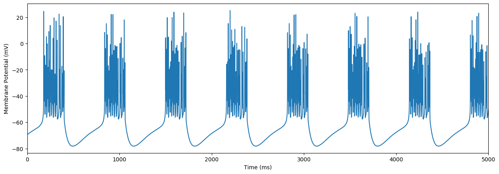

# Averaged Neuron (AN) model

AN model is a conductance-based (Hodgkin-Huxley type) neuron model performed mean-field approximation of a population of neurons. 

## Usage
``` python
import matplotlib.pyplot as plt
import anmodel
an = anmodel.models.ANmodel()
an.set_sws_params()
s, _ = an.run_odeint()
plt.plot(s[4999:, 0])
```


## Authors
- Fumiya Tatsuki
- Kensuke Yoshida
- Tetsuya Yamada
- Shoi Shi
- Hiroki R. Ueda

## License
This project is licensed under the MIT License - see the [LICENSE.txt](LICENSE.txt) file for details.